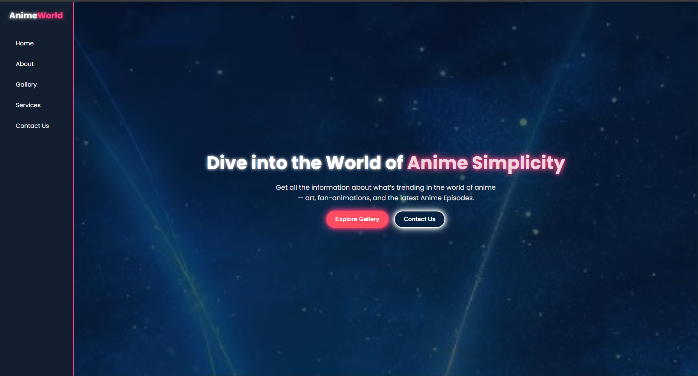
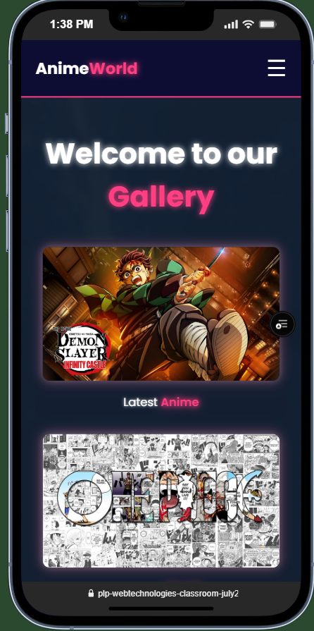

# AnimeWorld 🌸

AnimeWorld is a simple responsive website showcasing anime content, styled with a sidebar navigation and mascot section.  
It was built using **HTML** , **CSS** and **Js** only, with a focus on clean UI, responsive design, and smooth navigation.  

---

## 🌐 Live Demo
👉 [Visit AnimeWorld Live](https://plp-webtechnologies-classroom-july2-umber.vercel.app/)

---

## 📌 Features
- 🎨 Sidebar navigation with smooth hover effects  
- 🖼️ Hero/landing section introducing the site  
- 👩‍🎨 Mascot + Contact section with social links  
- 📱 Responsive design for desktop and mobile  
- ⚡ Styled footer with social media icons  

---

## 📂 Project Structure
```bash
├── assets
│   └── images        # All image files (artwork, mascots, banners, etc.)
│
├── css
│   └── styles.css    # Main stylesheet for the website
│
├── scripts
│   └── script.js     # JavaScript file for interactivity
│
├── index.html        # Main entry point of the website
└── README.md         # Project documentation

---
```
# 🚀 Getting Started

Clone the repository:

```bash
git clonehttps://github.com/Henri2611/plp-webtechnologies-classroom-july2025-july-2025-final-project-and-deployment-Final-Project-and-Depl

```


Open the project folder:

```bash
cd plp-webtechnologies-classroom-july2025-july-2025-final-project-and-deployment-Final-Project-and-Depl

```
Open the project by opening index.html in your browser

---

# 📸 Screenshots
🏠 Homepage


### 📱 Mobile View



